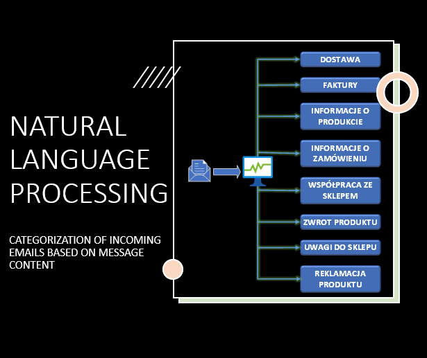
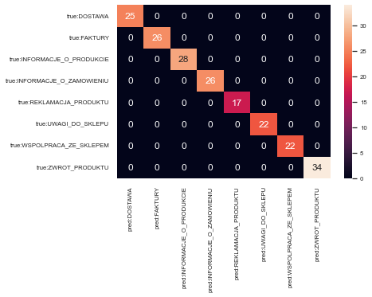

#  Natural Language Processing - email categorization

An example of a training and test result:

Used training email database: https://zazepa.pl/download/datasets/emails.csv
Accessed: 20 November 2022

Installation of the required packages and a description of the techniques used to categorize messages briefly described in the python program code.

